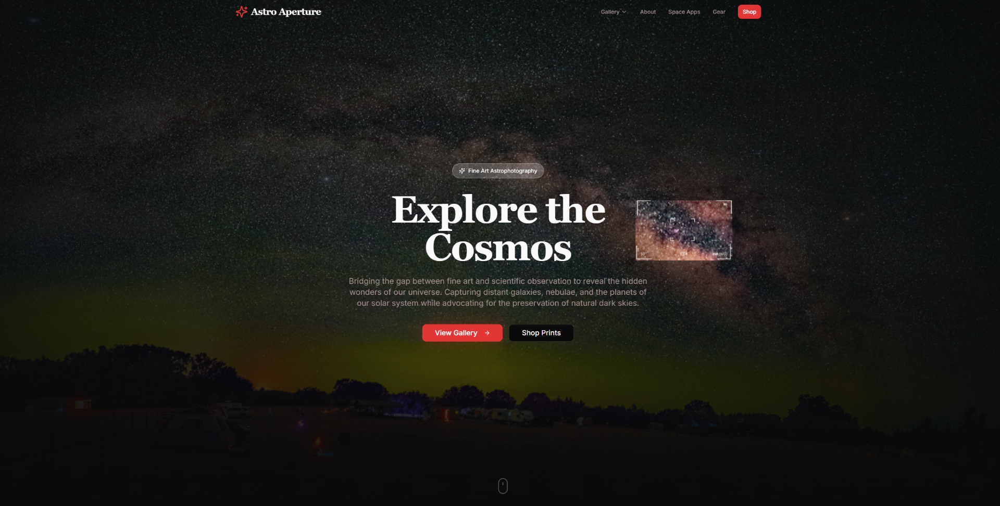
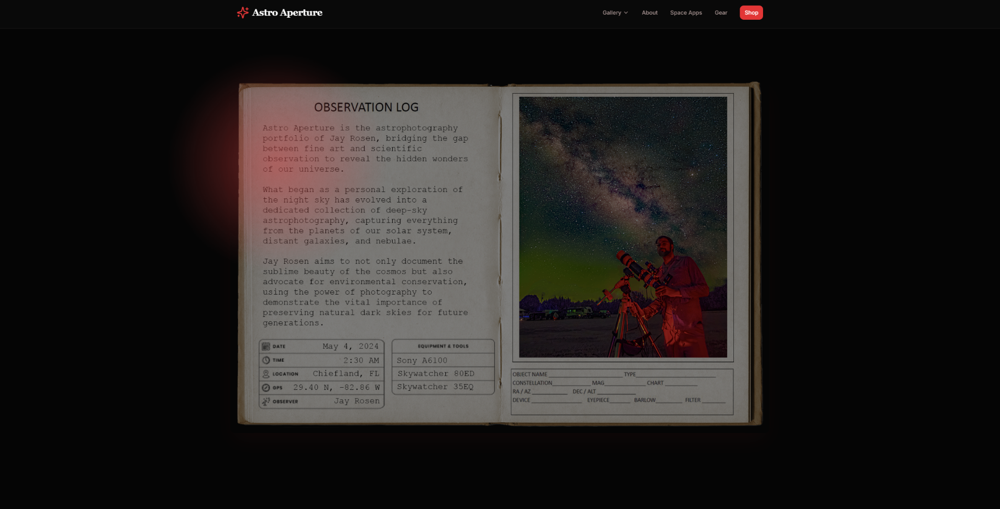
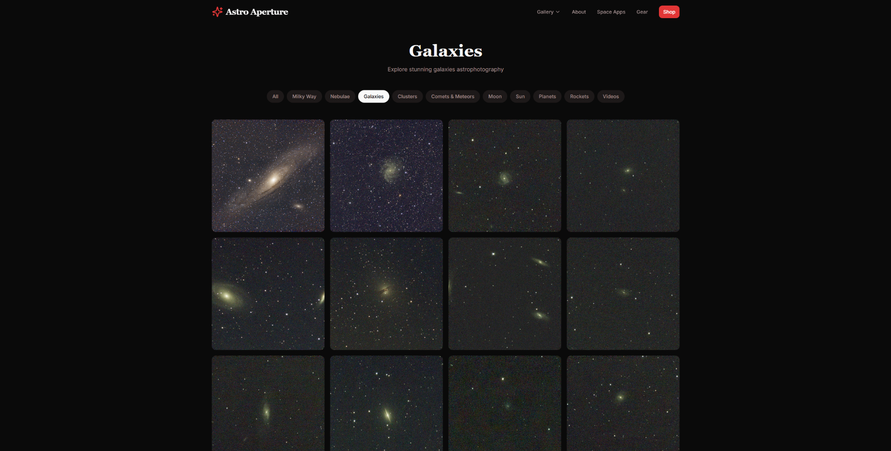
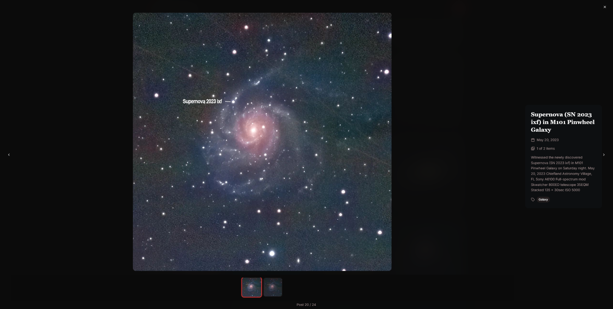
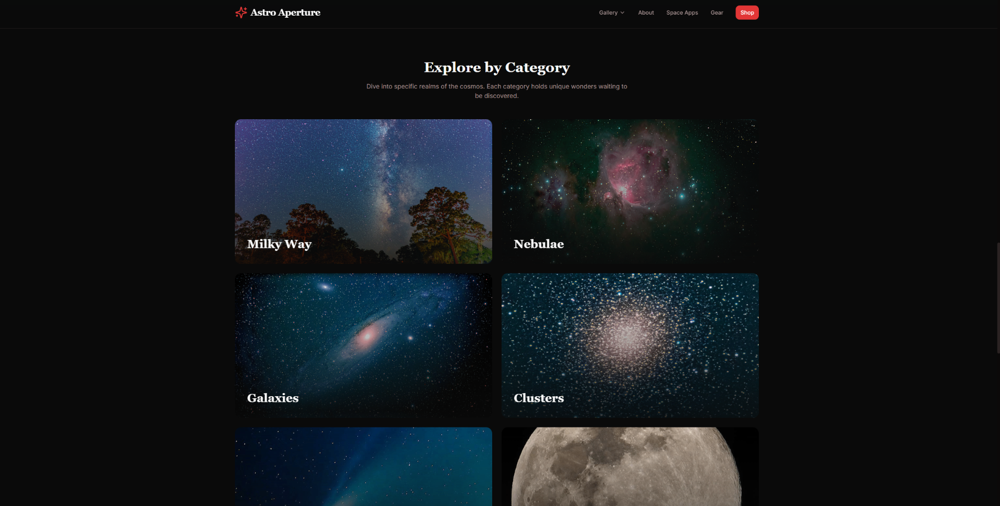
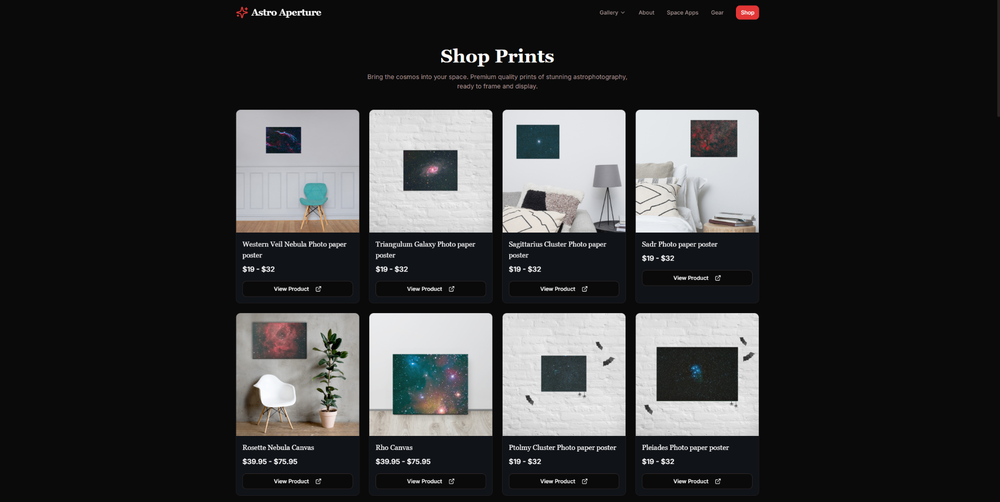
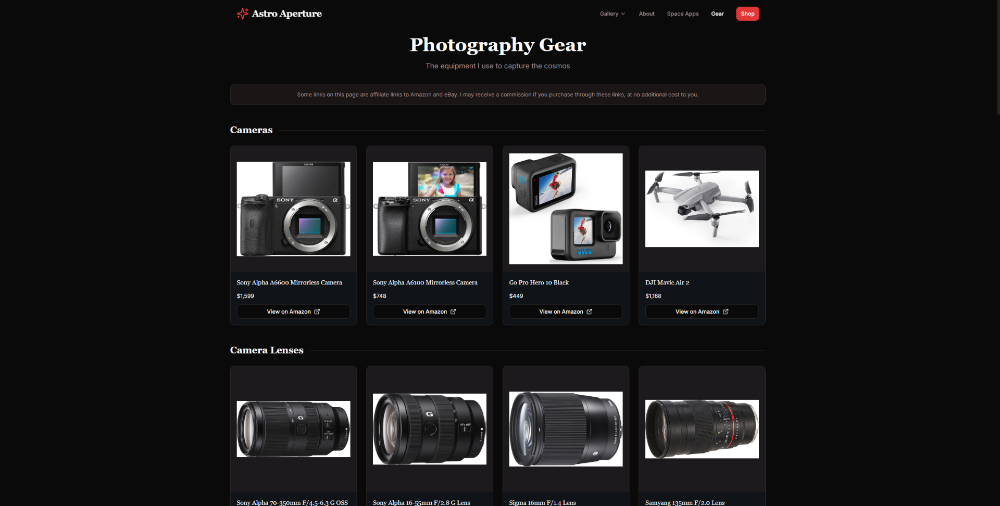
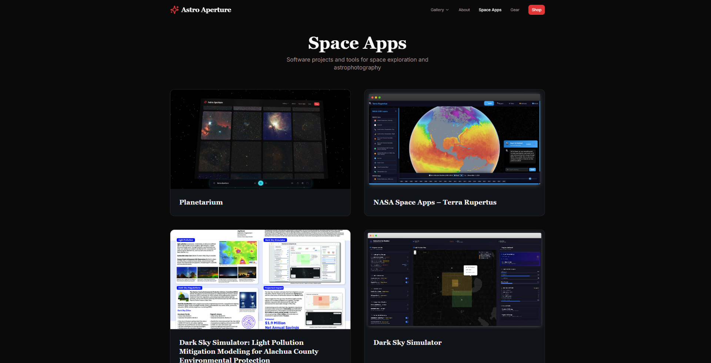

# Astro Aperture

A professional astrophotography portfolio website showcasing cosmic imagery captured by Jay Rosen.

## About the Project

Astro Aperture is a modern React application featuring a curated gallery of deep-sky astrophotography, from nebulae and galaxies to planetary imaging. The site connects to a WordPress GraphQL API to fetch photography content dynamically.

## Screenshots

| Homepage | About |
|:--------:|:-----:|
|  |  |

| Gallery | Lightbox |
|:-------:|:--------:|
|  |  |

| Categories | Shop |
|:----------:|:----:|
|  |  |

| Gear | Space Apps |
|:----:|:----------:|
|  |  |

## Key Features

- **Dynamic Gallery**: Browse astrophotography organized by categories (Milky Way, Nebulae, Galaxies, Clusters, Planets, Moon, Sun, and more)
- **Lightbox Viewing**: Full-screen image viewing with metadata
- **WordPress Integration**: Content fetched from jayrosen.design GraphQL API
- **Responsive Design**: Optimized for all devices using Tailwind CSS
- **Print Shop**: Browse and purchase astrophotography prints
- **Space Apps**: Explore interactive space exploration tools
- **Gear Showcase**: Photography equipment and telescope setups

## Tech Stack

- **Framework**: React 18 + Vite
- **Language**: TypeScript
- **Styling**: Tailwind CSS + shadcn/ui components
- **Data Fetching**: TanStack Query (React Query)
- **Routing**: React Router
- **Icons**: Lucide React
- **CMS**: WordPress (headless, via GraphQL)

## Project Structure

```
src/
├── components/
│   ├── gallery/        # Gallery grid, cards, lightbox, category pills
│   ├── home/           # Hero, about section, latest captures
│   ├── layout/         # Navbar, footer, layout wrapper
│   ├── shop/           # Product cards and grid
│   ├── gear/           # Equipment showcase
│   ├── space-apps/     # Space apps section
│   └── ui/             # shadcn/ui components
├── hooks/
│   ├── useAstroPosts.ts      # Gallery content queries
│   ├── useAstroProducts.ts   # Shop products
│   ├── useGear.ts            # Equipment data
│   └── useSpaceApps.ts       # Space apps data
├── lib/
│   ├── graphql.ts      # GraphQL queries and types
│   ├── utils.ts        # Utility functions
│   └── mediaParser.ts  # Media URL parsing
├── pages/
│   ├── Index.tsx       # Home page
│   ├── Gallery.tsx     # Photo gallery
│   ├── About.tsx       # About page
│   ├── Shop.tsx        # Print shop
│   ├── Gear.tsx        # Equipment showcase
│   ├── SpaceApps.tsx   # Space exploration apps
│   └── NotFound.tsx    # 404 page
└── assets/             # Static images and assets
```

## Getting Started

### Prerequisites

- Node.js 18+ and npm

### Installation

```bash
# Clone the repository
git clone <YOUR_GIT_URL>
cd astro-aperture

# Install dependencies
npm install

# Start development server
npm run dev
```

The site will be available at `http://localhost:5173`

## Development

### Available Scripts

| Command | Description |
|---------|-------------|
| `npm run dev` | Start development server with hot reload |
| `npm run build` | Build for production |
| `npm run lint` | Run ESLint |
| `npm run preview` | Preview production build locally |

### GraphQL API

The project connects to a WordPress GraphQL endpoint for content:

```
https://jayrosen.design/graphql
```

Key queries:
- `GET_ASTRO_POSTS` — Fetch astrophotography posts
- `GET_POSTS_BY_TAG` — Filter by category tags (nebula, galaxy, moon, etc.)
- `GET_ASTRO_PRODUCTS` — Fetch shop products

## Deployment

This project is configured for deployment via Lovable. To publish:

1. Open [Lovable](https://lovable.dev)
2. Navigate to your project
3. Click **Share → Publish**

For custom domain setup, go to **Project Settings → Domains**.

## License

© Jay Rosen — All rights reserved. Images and content may not be reproduced without permission.

## Links

- **Live Site**: https://astroaperture.lovable.app
- **Portfolio**: https://jayrosen.design
